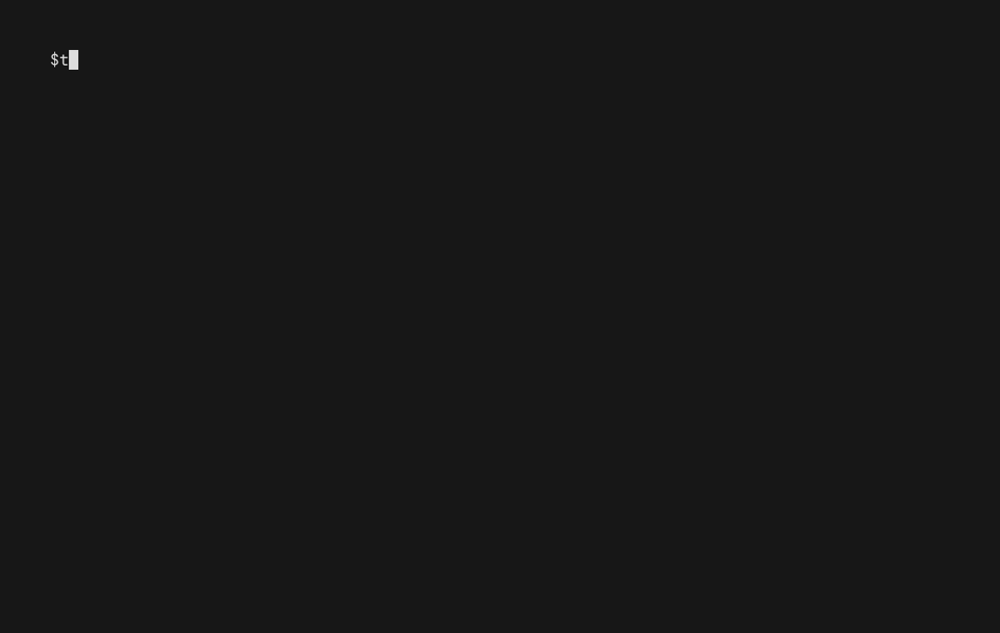

# TAKCLI

`takcli` is a modern operator CLI for Team Awareness Kit workflows.



The first milestone focuses on:
- profile and active-context management
- TAK server diagnostics with `doctor`
- TAK server operational summaries with `status`
- curated log observation with `observe logs`
- CoT query, target discovery, injection, and stream following with `cot`
- interactive Docker Compose deployment with `deploy`
- human-friendly output with stable `--json`

## Install

### npm
```bash
npm install -g @codehaus-au/takcli
```

### Convenience script
```bash
curl -fsSL https://raw.githubusercontent.com/codehausau/takcli/main/scripts/install.sh | bash
```

### Docker
```bash
docker run --rm ghcr.io/codehausau/takcli:latest version
```

## Quick start

Add a profile and make it current:

```bash
takcli profile add local --server https://127.0.0.1:8446 --insecure --set-current
```

Run diagnostics:

```bash
takcli doctor
takcli status
takcli observe logs list --deployment tak-demo
takcli cot query --uid my-uid
takcli cot targets
takcli map --open
takcli start map
takcli start replay ./data/adelaide-100km-march-2026.geojson
takcli users list
takcli deploy
takcli doctor --json
takcli status --server https://127.0.0.1:8446 --insecure --json
```

Use a one-off target without changing the active profile:

```bash
takcli doctor --server https://tak.example.internal:8446 --json
```

## Profile model

Profiles live in:

```text
~/.takcli/config.yaml
```

You can override that path with:

```bash
TAKCLI_CONFIG=/path/to/config.yaml takcli profile list
```

Example config:

```yaml
schemaVersion: 1
currentProfile: local
profiles:
  local:
    server: https://127.0.0.1:8446
    tls:
      certFile: /path/to/admin.pem
      insecureSkipVerify: true
      keyFile: /path/to/admin.key
      keyPassphrase: change-me
    ports:
      api: 8446
      enrollment: 8443
      federation: 8444
      cot: 8089
```

Port meanings:
- `ports.api`: primary HTTPS/WebTAK surface, `8446` in the local compose deployment
- `ports.enrollment`: secure admin/cert-management HTTPS surface, `8443` in the local compose deployment
- `ports.cot`: live CoT TLS stream, `8089` in the local compose deployment

`takcli` uses `ports.enrollment` for admin-style HTTPS routes such as CoT history lookups and file-user management, even when the profile `server` points at `8446`.

## Commands

### Implemented
- `takcli completion <bash|zsh|fish>`
- `takcli doctor`
- `takcli status`
- `takcli observe logs list`
- `takcli observe logs <target>`
- `takcli cot query`
- `takcli cot targets`
- `takcli cot inject`
- `takcli cot follow`
- `takcli replay file`
- `takcli map`
- `takcli start map`
- `takcli start replay`
- `takcli deploy`
- `takcli profile list`
- `takcli profile add`
- `takcli profile use`
- `takcli profile show`
- `takcli profile remove`
- `takcli users list`
- `takcli users create`
- `takcli users reset-password`
- `takcli users delete`
- `takcli users groups show`
- `takcli users groups add`
- `takcli users groups remove`
- `takcli users groups set`
- `takcli users groups list`
- `takcli users groups members`
- `takcli version`

### Roadmap
These command families are intentionally not shipped in v1 yet:
- `admin`
- Kubernetes deployment in `takcli deploy`

### Next candidates
Several strong next-step CLI surfaces for `takcli` are:

- `takcli cert`
  - create and rotate TAK CA, server, admin, client, and database TLS material
  - automate cert enrollment / Quick Connect bootstrap for the `8446` enrollment path
  - configure PostgreSQL TLS and validate cert wiring
- `takcli auth`
  - manage file-based users and groups
  - configure LDAP / Active Directory backends
  - inspect OAuth2 / token endpoint configuration
- `takcli users`
  - create, delete, bulk-create, and reset passwords for TAK users
  - inspect and update IN / OUT group membership
- `takcli inputs`
  - inspect and manage input listeners, group filtering, multicast routing, and auth mode
  - manage group-assignment behavior for x509 and authentication messages
- `takcli federation`
  - enable federation, upload federate certs, create connections, and manage outbound / mapped groups
  - inspect mission disruption tolerance and data-package / mission file blocking settings
- `takcli retention`
  - drive the data retention tool and validate retention configuration

The best near-term sequence is probably:
1. `cert`
2. `users` / `auth`
3. `federation`
4. Kubernetes deploy support
5. deeper observe summaries and metrics

## Map console

`takcli map` launches a local browser UI with:
- a live Leaflet map
- TAK status checks and target refresh controls
- CoT injection from the control panel
- optional live CoT streaming overlays
- optional replay dataset overlays

Product decision:
- primary replay workflow: `takcli start map` + `takcli start replay`
- secondary replay workflow: `takcli map --replay-file ...` for local inspection, demos, and side-by-side overlay work

Quick examples:

```bash
takcli map --open
takcli map --profile local --port 3000
takcli map --replay-file ./data/adelaide-100km-march-2026.geojson --open
takcli map --logo-label "Acme Air Ops"
takcli map --mode web --host 0.0.0.0 --port 3000
```

In headless shells, remote containers, or Codespaces, open the printed `http://...` URL manually instead of relying on browser auto-launch.

### Web mode

`takcli map --mode web` keeps the embedded server model, but binds it for remote/browser access instead of local desktop UX.

Use it when:
- you are running in Docker or Codespaces
- you want to reverse-proxy the UI
- you are demoing the UI from another machine on the network

Example:

```bash
takcli map --mode web --host 0.0.0.0 --port 3000
```

And from Docker:

```bash
docker run --rm -p 3000:3000 ghcr.io/codehausau/takcli:latest \
  map --mode web --host 0.0.0.0 --port 3000
```

`takcli start map` also supports `--mode web`. In web mode, `start map` disables browser auto-open by default and prints the UI URL for manual use.

## Start workflows

For the operator workflow where replay is injected into TAK and the map follows live CoT back from TAK:

```bash
takcli start map
takcli start replay ./data/adelaide-100km-march-2026.geojson
```

If you are in a headless environment, use:

```bash
takcli start map --no-open
```

`takcli start map`:
- launches the local map UI
- automatically starts following live CoT from TAK
- draws live session track lines per UID as updates arrive
- is the primary map mode once replay is being injected into TAK

`takcli start replay`:
- injects replay CoT into the TAK CoT stream
- reuses the same replay engine as `takcli replay file`
- is intended to be run while `takcli start map` is already following the server
- is the preferred replay path when you want the UI to reflect TAK-fed CoT instead of local-only playback

## Deploy workflows

`takcli deploy` is a compose-first wizard that:
- checks for `git`, `docker`, and `docker compose`
- clones or reuses the official `TAK-Product-Center/Server` repo in `~/.takcli/cache/tak-server`
- copies the upstream `docker/full` assets into a TAKCLI-managed deployment workspace
- renders a TAKCLI-owned `.env`, compose file, and deployment metadata beside the upstream copy
- prompts for deployment secrets interactively and writes the generated `.env` with restricted permissions
- starts the stack with `docker compose up -d`

The default image sources are:
- `docker.io/codehausau/takserver-full:<tag>`
- `postgis/postgis:15-3.3`

Quick example:

```bash
takcli deploy \
  --target docker-compose \
  --ref main \
  --name tak-demo \
  --registry codehausau \
  --image-tag latest
```

For non-interactive use, you can provide the required deployment values up front:

```bash
takcli deploy \
  --target docker-compose \
  --ref main \
  --name tak-demo \
  --deployment-root ~/.takcli/deployments/tak-demo \
  --data-dir ~/.takcli/deployments/tak-demo/data \
  --logs-dir ~/.takcli/deployments/tak-demo/data/logs \
  --certs-dir ~/.takcli/deployments/tak-demo/data/certs \
  --registry codehausau \
  --image-tag latest \
  --postgres-password change-me \
  --ca-name tak-demo-CA \
  --ca-pass change-me \
  --state ACT \
  --city Canberra \
  --organization CodeHaus \
  --organizational-unit Ops \
  --takserver-cert-pass change-me \
  --admin-cert-name admin \
  --admin-cert-pass change-me \
  --save-profiles \
  --yes
```

Add `--save-profiles` when you want a non-interactive deploy to register the generated local TAK profiles automatically. This creates both `<deployment-name>` and `<deployment-name>-admin` and sets the default profile current.

Optional ADS-B sidecar examples:

```bash
takcli deploy \
  --target docker-compose \
  --name tak-demo \
  --with-adsb \
  --adsb-source mil

takcli deploy \
  --target docker-compose \
  --name tak-demo \
  --with-adsb \
  --adsb-source geo \
  --adsb-lat 60.3179 \
  --adsb-lon 24.9496 \
  --adsb-dist-nm 25
```

ADS-B acceptable use note:
- `takcli`'s generated ADS-B config links to the adsb.fi open data terms at https://github.com/adsbfi/opendata/blob/main/README.md
- The public adsb.fi endpoints are intended for personal, non-commercial use, require attribution to adsb.fi with a link to their home page, and are rate limited to 1 request per second.
- For new geographic integrations, prefer the `v3 /lat/.../lon/.../dist/...` endpoint rather than the deprecated `v2` geographic endpoint.

## CoT workflows

`takcli cot query` and `takcli cot targets` resolve their HTTPS lookups through `ports.enrollment` by default. In the local compose deployment that is `8443`, while `ports.api` remains `8446` for the main WebTAK surface.

Query the latest CoT event for a UID:

```bash
takcli cot query --uid alpha --server https://127.0.0.1:8446 --insecure
takcli cot query --uid alpha --server https://127.0.0.1:8446 --insecure --raw
```

List recent CoT targets from the last 24 hours:

```bash
takcli cot targets --server https://127.0.0.1:8446 --insecure
takcli cot targets --start-date 2026-03-16 --end-date 2026-03-17 --limit 25 --json
```

Inject a generated CoT event over the live TLS CoT port:

```bash
takcli cot inject \
  --uid alpha \
  --type a-f-G-U-C \
  --lat -35.3 \
  --lon 149.1 \
  --callsign "Eagle 1"
```

Follow the live CoT stream:

```bash
takcli cot follow
takcli cot follow --limit 10 --json
```

## Replay workflows

Replay a historical GeoJSON vessel-track file into the TAK CoT stream:

```bash
takcli replay file ../data/adelaide-100km-march-2026.geojson \
  --source auto \
  --start-from start \
  --speed 3600
```

Replay the same kind of dataset from an HTTP or HTTPS URL:

```bash
takcli replay file https://example.invalid/tracks.geojson \
  --source auto \
  --start-from start \
  --speed 3600
```

Inspect the detected source and time range without sending CoT:

```bash
takcli replay file ../data/adelaide-100km-march-2026.geojson --describe
```

## User workflows

The TAK file-user-management endpoints are usually exposed on the secure web/admin port. `takcli users` uses `ports.enrollment` for those routes, which is `8443` on the local compose deployment in this workspace.

Example profile for an admin client certificate:

```bash
takcli profile add local-admin \
  --server https://127.0.0.1:8443 \
  --api-port 8443 \
  --cert-file /path/to/admin.pem \
  --key-file /path/to/admin.key \
  --key-passphrase change-me \
  --insecure \
  --set-current
```

If your TAK client key is already unencrypted, omit `--key-passphrase`.

Example user-management flows:

```bash
takcli users list
takcli users create alice --password 'Ch@ngeM3whenyoucan' --group Blue --out-group Green
takcli users reset-password alice --password '@lsoCh@ngeM3WhenYouCan'
takcli users groups show alice
takcli users groups add alice --in-group Red
takcli users groups remove alice --out-group Green
takcli users groups members Blue
takcli users delete alice
```

## Observe workflows

`takcli observe logs` works against deployments already tracked by `takcli deploy`. If you have more than one tracked deployment, pass `--deployment <name>` or switch to a profile associated with the deployment you want to inspect.

List curated log targets:

```bash
takcli observe logs list --deployment tak-demo
takcli observe logs list --deployment tak-cluster --json
```

Read recent lines from a tracked server log:

```bash
takcli observe logs api --deployment tak-demo --lines 200
takcli observe logs config-console --deployment tak-demo
```

Follow a live log stream:

```bash
takcli observe logs messaging --deployment tak-demo --follow
takcli observe logs database --deployment tak-cluster --follow
```

## CLI demos

This repo includes reproducible terminal demo tapes for README assets using `vhs`.

Render the sample demos with:

```bash
pnpm demo:readme:live
```

`pnpm demo:readme:live` starts a dedicated renderer container on the same Docker network as a running local TAK compose deployment and exercises real `status`, `doctor`, `users`, `cot`, and compose `deploy` commands. Demo sources live in [`docs/demos/`](./docs/demos/README.md) and generated assets are written to `docs/assets/`.

## Development

```bash
pnpm install
pnpm lint
pnpm typecheck
pnpm test
pnpm build
```

## TAK Server Images

The hardened TAK Server Docker images require Iron Bank base images, so the practical publishing path today is the **unhardened** image set.

There is a helper script for building release-tagged unhardened images from an upstream `tak-server` checkout:

```bash
./scripts/build-unhardened-takserver-images.sh \
  --tak-server-repo /path/to/tak-server \
  --tag 5.2-RELEASE-16 \
  --platforms linux/amd64,linux/arm64 \
  --image-prefix docker.io/codehausau
```

More detail is in [docs/unhardened-takserver-images.md](/workspaces/tak/takcli/docs/unhardened-takserver-images.md).

## Shell completions

Generate a completion script for your shell:

```bash
takcli completion bash
takcli completion zsh
takcli completion fish
```

Examples:

```bash
takcli completion bash > ~/.local/share/bash-completion/completions/takcli
takcli completion zsh > "${fpath[1]}/_takcli"
takcli completion fish > ~/.config/fish/completions/takcli.fish
```

## Release model

This repository is designed for:
- Conventional Commits
- Release Please managed versioning and changelogs
- npm publishing as `@codehaus-au/takcli`
- Docker publishing to GitHub Container Registry

## GitHub setup

To get CI/CD and publishing working on `https://github.com/codehausau/takcli`, configure these GitHub Actions secrets:

- `NPM_TOKEN`
  - npm automation token with permission to publish `@codehaus-au/takcli`
- `RELEASE_PLEASE_TOKEN`
  - recommended when the repository or organization does not allow the default `GITHUB_TOKEN` to create pull requests
  - if using a fine-grained PAT, grant repository access with:
    - `Contents: Read and write`
    - `Pull requests: Read and write`
    - `Issues: Read and write`

Workflow behavior:

- pull requests run CI and semantic PR checks
- pushes to `main` run Release Please
- published GitHub releases run npm and GHCR publishing

Notes:

- `release-please.yml` prefers `RELEASE_PLEASE_TOKEN` and falls back to the built-in `GITHUB_TOKEN`
- if your organization has disabled “GitHub Actions can create and approve pull requests”, Release Please will need `RELEASE_PLEASE_TOKEN`
- GitHub currently warns that `googleapis/release-please-action@v4` still runs on the older Node 20 action runtime; this is an upstream action warning rather than a TAKCLI code issue
